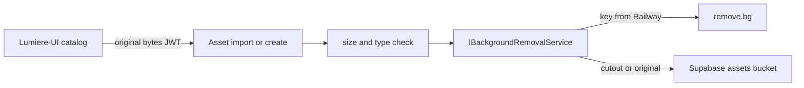

# RFC: Catalog background removal

**Project:** Lumiere
**ID:** rfc-lumiere-bg-removal
**Date:** 2026-09-12
**Version:** 0.1
**Status:** Locked
**Last reconciled:** 2026-09-13
**PRD:** PRD-F14, PRD §7
**SDD:** §8
**RFC ID:** lumiere-rfc-002

This file is the provider decision for catalog cutouts. Locked decision record.

## 1. Context and objective

**The problem this solves:**

`BackgroundRemovalService` sleeps 100ms and returns the same stream. The comment names Remove.bg. Catalog ingest (`AssetImportService.ImportAssetsPhase2Async`) already calls the interface, then uploads to Supabase Storage. The SPA `AddAssetModal` also runs a client chroma-key. Two paths. Neither is a production model.

**Reference:** PRD-F14 Must-Have. SDD §8. AIA launch gate.

**Success criteria:**

- Catalog add and bulk-import phase 2 store a cutout when the vendor succeeds.
- Vendor down stores the original, logs the failure, and does not claim a cutout.
- No vendor key in the SPA or in git.
- Damage photos never enter this pipeline.

## 2. Proposed solution

**Approach:** keep `IBackgroundRemovalService` as the only production component. Replace the mock with a server-side HTTP call to third-party vision API remove.bg (confirmed vendor pick). Railway holds the key. The SPA sends original bytes to the API and displays whatever Storage URL the API returns.

**Architecture changes:**

- `BackgroundRemovalService` becomes a typed HTTP client. Timeout, size cap, content-type check.
- Config: `BackgroundRemoval__ApiKey`, `BackgroundRemoval__Endpoint` from Railway. Missing key in Production fails the removal call (store original), does not crash the API process.
- On vendor success, upload the cutout PNG to `assets` / `asset-photos/`.
- On vendor failure, upload the original if it is a valid image, log warning, leave no cutout claim.
- Remove or demote SPA `processBackgroundRemoval` so it cannot be mistaken for the model.

## 3. Technical details

**No schema change required.** `Asset.PhotoUrl` already holds the Storage URL.

**Contract:**

- Input stream: JPEG/PNG/WebP. Max 8 MB unless the locked vendor docs demand less.
- Output stream: PNG with alpha when the vendor succeeds.
- Auth: existing JWT. WOM / Purchasing / Admin as already required for asset create.
- Secrets: never returned in API error bodies.

**Rejected for first ship**

| Option | Why not first |
|--------|----------------|
| SPA chroma-key as the product | Not a model. Leaks no key but ships a fake. SDD-8.1-02. |
| Self-hosted ONNX/GPU on Railway | Extra image, GPU cost, ops. Valid later if vendor terms fail CLR. |
| Call the vendor from the browser | Key would live in Vercel. Forbidden. |
| Keep the mock in Production | PRD-F14 Must-Have. AIA forbids silent passthrough. |

**Confirmed vendor pick:** remove.bg HTTP API behind the existing interface (locked as final vendor choice).

## 4. Verification

QAD PRD-F14 cases. AIA-R1 through AIA-R5. CLR sub-processor row. OPS env list.

## 5. Rollback

Previous Railway deployment restores the prior service. Storage objects already written stay. No migration down.
