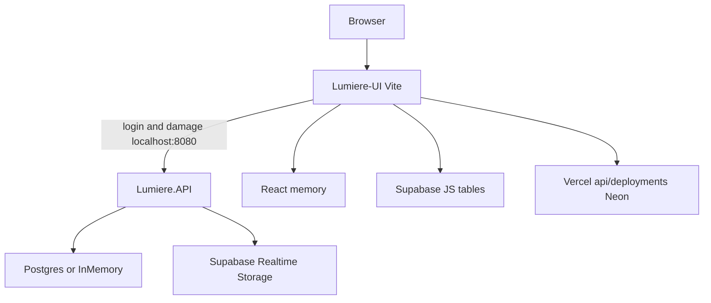
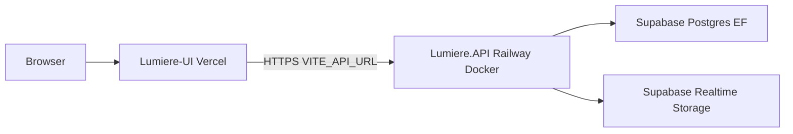

# System Design Document (SDD)

**Project:** Lumiere
**Date:** 2026-09-12
**Version:** 0.1
**Owner:** Lumiere team
**Status:** Locked
**Last reconciled:** 2026-09-13

This file is the architecture. As-built is what the two repos do today. Target is Vercel + Railway Docker + one Supabase Postgres. You can operate from this file without the RFC; the RFC is the decision record for the same choice.

## 1. Architectural Vision & Principles

**Architecture style:** Modular monolith API (`Lumiere.API` + Application / Core / Infrastructure) and a Vite SPA. Not microservices. Not Vercel serverless for the API.

**Guiding principles:**
- One system of record: EF Core on one Postgres.
- Guards at the HTTP boundary (JWT, `[Authorize]`, `[RequireRole]`, XSS filter). Trust internal types.
- Production fails closed if Postgres is down. No silent InMemory.
- Frontend talks to the API over HTTPS using `VITE_API_URL`. Nothing else owns users or events.

**Key trade-offs:**
- Railway first, GCP Cloud Run later. Faster ship vs native GCP IAM.
- Supabase as hosted Postgres plus Realtime/Storage, not as a second app database and not as the login provider.
- Keep custom JWT. Do not migrate to Supabase Auth in this slice.

## 2. High-Level Architecture

**As-built**

Two models, one login wire. Damage GET is a translator. Field pairs are in `contracts-fe-be.md`.

**Target**

| Layer | As-built | Target |
|-------|----------|--------|
| Client | Vite 6, React 19, Tailwind 4, Konva. In-memory router. | Same SPA. `VITE_API_URL`. Drop Neon client for deployments. |
| API | ASP.NET Core 10, Kestrel `PORT` default 8080 | Same container on Railway |
| Data | EF Npgsql or InMemory. Plus browser Supabase. Plus Neon. | EF Npgsql only for records. Realtime/Storage add-on. |
| Infra | Laptop + static Vercel demo | Vercel + Railway + Supabase project |

Solution: `Lumiere.slnx`. Projects `Lumiere.API`, `Application`, `Core`, `Infrastructure`. SDK `10.0.103` in `global.json`. Application currently references Infrastructure (layer inversion). Accept for now. Do not add a fifth database to paper over it.

## 3. Data Architecture

**Primary database (target):** PostgreSQL hosted by Supabase. Connection string `ConnectionStrings:DefaultConnection`. EF migrations in `Lumiere.Infrastructure/Migrations` are the schema owner.

**As-built extra stores (retire):**
- InMemory `LumiereDb` when the startup Postgres ping fails (`Program.cs`).
- Browser tables: `portal_accounts`, `crew_roster`, `manning_assignments`, `manning_dispatch_batches`, `audit_logs`.
- Neon `warehouse_deployments` via `Lumiere-UI/api/deployments.ts`.
- Hand-written SQL under `supabase/migrations` that disagrees with EF (`roles.id` vs `roles.role_id`). Do not apply that pack at runtime. Runtime already uses `MigrateAsync`.

**Core entities (EF):** User, Role, Event, EventFinancials, Asset, Reservation, DispatchPreparationQueue, DamageReport, Deficit, Vendor, Audit, EphemeralPermission, InvestigationTicket.

**Realtime:** channel `asset-transitions` after reservation/dispatch/asset commits. Fire-and-forget. DB commit wins.

**Cache:** `IMemoryCache` for lockout and token blacklist. Single instance only. Multi-instance Railway later needs a shared store. Accept for first ship (one replica).

## 4. API surface (as-built)

| Prefix | Auth |
|--------|------|
| `POST /api/auth/login` | anonymous |
| `POST /api/auth/login-debug` | anonymous (defect) |
| `POST /api/auth/refresh` | 501 |
| `api/admin/permissions/ephemeral` | Admin |
| `api/events` | Authorize; create/update Admin; loss-maker Executive |
| `api/assets`, bulk-import, vendors-on-asset | Authorize (role holes) |
| `api/reservations` | Authorize + canvas filter |
| `api/dispatch` | Warehouse Operations Manager |
| `api/deficit-queue` | Authorize |
| `api/damage-reports` | Authorize; admin-unblock Admin |
| `api/vendors` | Authorize |

JSON camelCase. CORS target: http://localhost:5173, https://lumieredemo-seven.vercel.app. CamelCase does not make drawer fields bind to `CreateEventRequest`. See `contracts-fe-be.md`.

## 5. Security

| Topic | As-built | Target |
|-------|----------|--------|
| Auth | Custom JWT 8h/12h | Same, secret from Railway env |
| Passwords | BCrypt 12 | Same. Stop seeding known password in Production |
| XSS | HtmlSanitizer global filter | Keep |
| HTTPS redirect | Off when `IsProduction()` | Terminate TLS at Railway. API HTTP inside the container is OK if the platform terminates TLS |
| CORS | Two hardcoded origins | localhost:5173 + https://lumieredemo-seven.vercel.app |
| Health | none | `GET /health` for Railway. OPS SLO uses this probe. |

## 6. Workers

- `LostInActionAuditWorker` hourly.
- `EphemeralExpiryAuditWorker` every 15 minutes.

These need a running process. That is why the API is not a Vercel function.

## 7. NFRs

- First ship: single Railway replica. Session lockout/blacklist not shared.
- Login p95: not measured. Budget: under 500ms excluding cold start.
- Data integrity: reservation bulk in a DB transaction (already in `ReservationService`).

## 8. AI

**Component:** PRD-F14 catalog background removal. Architecture decision: `rfc-lumiere-bg-removal.md`.

**As-built:** `IBackgroundRemovalService` / `BackgroundRemovalService` is a 100ms sleep and passthrough. `AssetImportService.ImportAssetsPhase2Async` calls it, then uploads to Storage bucket `assets`. On exception it logs and may leave `Photo Pending`. The SPA `processBackgroundRemoval` in `AddAssetModal.tsx` is a client chroma-key. It is not this component.

**Target**

- Bound at the API. The SPA sends original catalog bytes. It does not call the vendor. It does not hold the vendor key.
- Input: untrusted user-uploaded image streams on catalog add and bulk-import phase 2.
- Output: PNG/WebP with alpha. Content-type and size checked at the API boundary before the vendor call.
- Fail closed to original image plus a logged error. Do not claim a cutout. Do not return a chroma-key fake.
- No tool-calling. No prompt surface. Image bytes are data, not instructions.
- Damage photos stay on the damage pipeline. They do not enter `IBackgroundRemovalService`.
- Vendor API key in Railway only (`BackgroundRemoval__ApiKey` or the name locked in the RFC).

### 8.1 Safety and threat surface

| ID | Threat | Control |
|----|--------|---------|
| SDD-8.1-01 | Silent passthrough shipped as ML | Production SHALL NOT register the mock implementation. QAD-F14 sad/abuse. |
| SDD-8.1-02 | SPA chroma-key treated as the model | Delete or demote to local preview. AIA and this section name the API service only. |
| SDD-8.1-03 | Vendor key in the SPA or git | Key only in Railway. SPA has no removal env. |
| SDD-8.1-04 | Poisoned or huge upload | Max size and content-type at the API. Reject non-image. |
| SDD-8.1-05 | PII / faces in warehouse shots sent to a US/EU vendor | Catalog photos only. CLR sub-processor row. Counsel if people are routinely in frame. AIA escalation. |
| SDD-8.1-06 | Damage photos mixed into cutout | Separate endpoints. QAD-F14 abuse. |
| SDD-8.1-07 | Vendor down, fake success | Catch, store original, log, do not set a cutout flag. |

## 9. Related (optional)

Decision writeups: `rfc-lumiere-deploy.md`, `rfc-lumiere-bg-removal.md`. Runbook: `ops-lumiere.md`. Product ids: `prd-lumiere.md`. Assurance: `aia-lumiere.md`.
